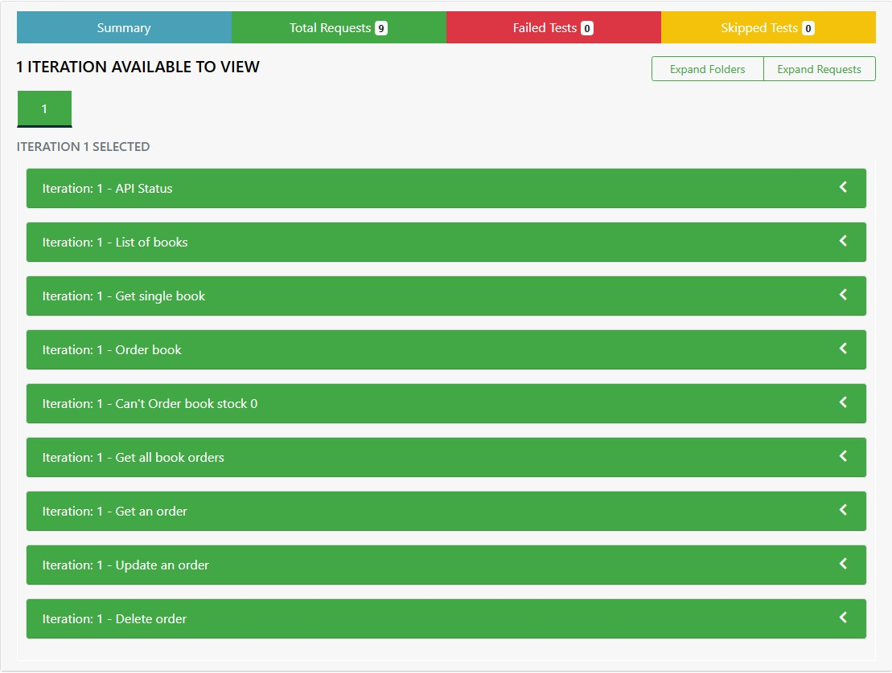

# Postman Beginner's Course - API Testing Practical Project

This repository contains the practical project that accompanies the **Postman Beginner's Course - API Testing** from freecodecamp.org youtube channel. The project showcases the application of various API testing techniques learned during the course. It includes examples of HTTP requests, test automation, and CI/CD integration using Postman. Also using htmlextra to reporting an API testing with html format. Here link to access course : https://www.youtube.com/watch?v=VywxIQ2ZXw4&list=LL

## Project Overview

This project demonstrates key concepts and best practices in API testing, including:

- **HTTP Requests**: Implementation of GET, POST, PATCH, and DELETE requests.
- **Postman Collections**: Organized collections of requests to efficiently manage API tests.
- **Variables**: Usage of environment and collection variables for dynamic testing.
- **API Authentication**: Secure API requests using different authentication methods.
- **Test Automation**: Writing and running automated tests in Postman.
- **Newman**: Using Newman to execute collections from the command line and generate HTML reports.
- **CI/CD Integration**: Overview of integrating Postman tests into a CI/CD pipeline.

## Live Demo



The project is deployed on GitHub Pages. You can view the live demo here: [GitHub Pages Link](https://hbibakbr.github.io/PostmanPractice/)

## Installation

To run this project locally, follow these steps:

1. **Download File json**:
    ```bash
    postman_simple_book.json
    ```

2. **Install Newman** (if not already installed):
    ```bash
    npm install -g newman
    ```

3. **Run the Postman Collection**:
    ```bash
    newman run postman_simple_book.json
    ```

## Acknowledgments

- **FreeCodeCamp**: For providing the Postman Beginner's Course that inspired this project.
- **Postman**: For the tools and resources that make API testing accessible.
